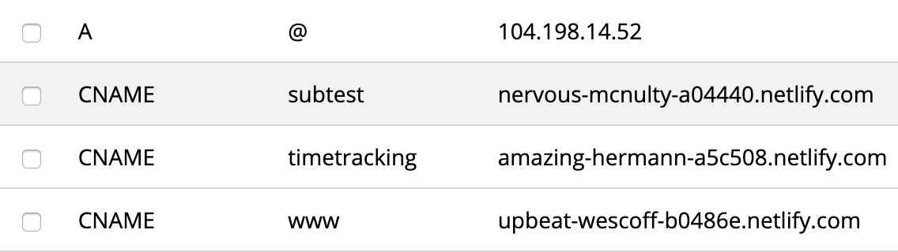

+++
title = "This Website Stack"
# publish date
date = 2020-01-04T16:07:15-05:00
# whether or not the post is a draft
draft = true
#  Short description of the document (limit to 150 characters)
# This content *may* be used as a part of search engine results.
description = 'Deploying a website with netlify and hugo.'
+++

The registrar for this website is [hover](https://www.hover.com/). The site is generated using the [victor hugo netlify template](https://github.com/netlify-templates/victor-hugo) and is statically deployed using [netlify's](https://netlify.com) continuous github integration.

The [victor hugo netlify template](https://github.com/netlify-templates/victor-hugo) lets me use modern es6 javascript which I used to create the
animation in the background.

