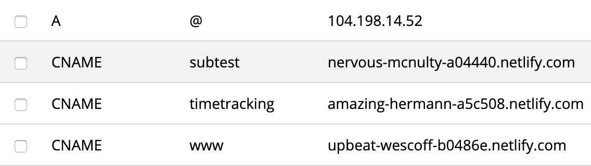

+++
title = "This Website's Stack"
# publish date
date = 2020-01-04T16:07:15-05:00
# whether or not the post is a draft
draft = false
#  Short description of the document (limit to 150 characters)
# This content *may* be used as a part of search engine results.
description = 'Deploying a modern website with netlify, hover, and hugo.'
+++

Over the past couple of years I've rewritten my website a couple times. I never wrote about the technical choices I made, but I finally found a stack that seems extensible, fast, and nice to work with so I've written it up here.

<!--more-->

The registrar for this website is [hover](https://www.hover.com/). The site is generated using the [victor hugo netlify template](https://github.com/netlify-templates/victor-hugo) and is continuously deployed using [netlify's](https://netlify.com) github integration features.

## Modern Hugo

The [victor hugo netlify template](https://github.com/netlify-templates/victor-hugo) uses [hugo](https://gohugo.io/) as a static site generator and [Webpack](https://webpack.js.org/) to manage the asset pipeline. The template lets me easily integrate modern es6 javascript and scss stylesheets into
the website. I use javascript to create the nice animations in the background. 
I use scss to keep my stylesheets [DRY](https://en.wikipedia.org/wiki/Don%27t_repeat_yourself).

The [hugo](https://gohugo.io/) theme was written by me in a single night. Further iterations were made to render text correctly on mobile.

## Single Location

I want my website to be able to host all my side projects. Having projects
on various `github.io` or `heroku` domains is ok but it's hard to remember all those various links, and the domains are a little impersonal. I want the things I make to be hosted in one place, preferably my site.

Because I use [netlify](https://netlify.com) and [hover](https://hover.com) I was able to use [this tutorial](https://dev.to/tvanblargan/website-deployment-with-hover-netlify-1b7j) to easily attach my domain to my site. The end of the tutorial deals with attaching subdomains. Instead of following those instructions I deploy side projects to netlify through github then add a CNAME record to hover. Netlify has docs about that process [here](https://docs.netlify.com/domains-https/custom-domains/configure-external-dns/#configure-a-subdomain).

## Open Source

All the code for the site is open source and can be found [on github](https://github.com/lukesmurray/victor-hugo).